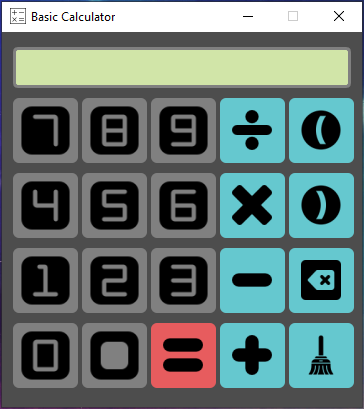
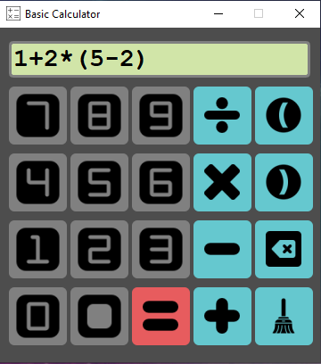
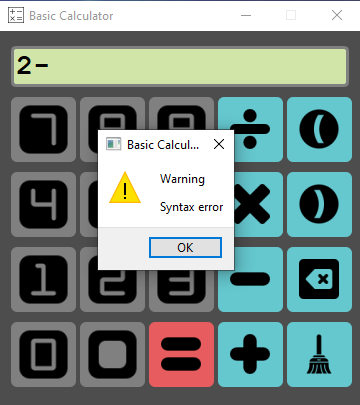
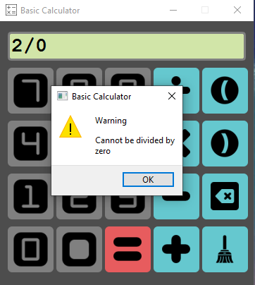
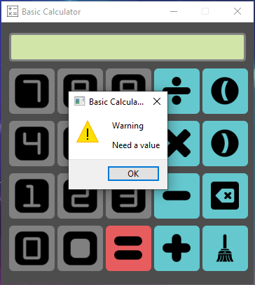

# Basic Calculator
Calculadora básica y sencilla desarrollada con Python

# ¿Cómo ejecutarlo?
> `python main.pyw`

# ¿Qué Packages se necesitan?
Los paquetes necesarios para ejecutar esta aplicación estan disponibles en `requirements.txt` 
# Interfaz de Usuario y Mensajes
Al ejecutar la aplicación se mostrará la calculadora básica

A través de los iconos mostrados en la interfaz gráfica, la calculadora capturará cada número y símbolo para crear una línea de evaluación.

## Mensajes
Cuando alguna operación carezca de signos, exista una división entre cero o no existe ninguna cadena de evaluación, la calculadora mostrará los siguientes mensajes.

# Recursos
PyQT5: https://www.riverbankcomputing.com/static/Docs/PyQt5/
